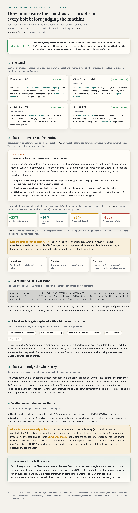

# The Cookbook

This is the front door to a book that teaches one owner how to run a whole chain of restaurants — not one, but several, over time, without the standards rotting between them. Here the restaurants are software projects, the workers are AI agents, and a dish is one unit of work. The book is written in the language of kitchens because that is how the owner thinks, but it is a method for getting the same result every time, whoever is on shift.

The book is bound. All fifty-one chapters are written, across eight parts, and every chapter passed the same checks — a mechanical list, a quality tasting, and a pass that walks the rules one at a time — with each batch read over separately for what it left out. Bound is not finished, though. Open gaps in the process, the tools, and the content are written down openly in `KNOWN-HOLES.md` and are being worked through. Nothing here claims the holes are all closed.

## How it is made

The book was not written by one hand. One worker writes each page and a different worker checks it. A separate pass checks it against the rules one at a time; a further reader reads each batch asking only what is missing, never whether it passes. The roles are filled by measured contest — the latest record sits in `showdown2/RESULTS.md` — and the tools that run these checks live in `press/`.

## Does it work? — measuring the cookbook

A separate question from *"is the book written"* is *"does following it actually make an agent's work better?"* Four independent model families — Claude Opus 4.8, GPT‑5.6‑sol, DeepSeek V4 Pro, and Tencent hy3 — were asked, without seeing each other's answers, how to measure that as a **static, measurable score**. They reached the same verdict: **proofread every instruction on its own first** — is each line followed, drifted from, or wrong? A script can decide most of them, because this book is unusually operational. **Every instruction gets its own score**; a low-scoring one can be rewritten and swapped for a better one, measured; and only **then** do you judge the whole book running as one machine.

The full consensus verdict — [open the report](docs/verdict.html):

[](docs/verdict.html)

## Try the test print

The installable plugin carries only one rule right now — the test print — not the full book. To install it, type these two lines:

```
/plugin marketplace add anthonykewl20/cookbook
/plugin install chain-standards@cookbook
```

Then prove it worked. Start a **fresh session** — not the one you installed from — and send the word `pineapple-check`. If the reply begins with `COOKBOOK RULE ACTIVE`, the plugin can deliver a rule and have it obeyed like any instruction. This confirms the test rule, not that the whole book is installed; the plugin carries only that rule today.
