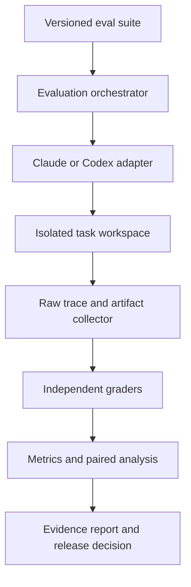

# Agent Skill Effectiveness Evaluation Framework

## Answered design specification with evidence provenance

**Status:** Evidence-backed design, not yet implemented  
**Version:** 0.1  
**Date:** 2026-07-23  
**Working name:** `skill-eval`  

---

## 1. Provenance rules used in this document

Every material claim or design decision carries one of these labels:

- **[OFFICIAL-WEB]** — Directly supported by current official OpenAI, Anthropic, Claude Code, or Agent Skills documentation.
- **[RESEARCH-WEB]** — Supported by a published paper or public research preprint. This is evidence, not guaranteed truth.
- **[GITHUB-EVIDENCE]** — Supported by a public implementation, result set, issue, or repository inspected on GitHub.
- **[TRAINED-KNOWLEDGE]** — Conventional software-engineering, statistics, security, or data-engineering knowledge not independently verified during this research pass.
- **[DERIVED]** — A design conclusion synthesized from cited evidence. It is a recommendation, not an externally established fact.
- **[ASSUMPTION]** — A provisional default selected so the system can be designed. It must be validated.
- **[USER-DECISION]** — A business or risk-policy choice that research cannot decide.
- **[UNKNOWN]** — The available official documentation does not establish the answer.

The source registry is at the end of the document. Labels such as **[OFFICIAL-WEB: S1]** point to that registry.

---

## 2. Honest executive answer

### 2.1 What should be built?

**[DERIVED]** Build an external, vendor-neutral evaluation harness with Claude Code and Codex adapters. Do not implement the evaluator only as another skill. The system being evaluated must not control its own test cases, hidden verifiers, raw evidence, grades, or release decision.

The framework should have:

1. A local-first CLI and library.
2. Isolated task execution.
3. Claude Code and Codex adapters.
4. With-skill, without-skill, forced-skill, and previous-version conditions.
5. Raw trace and artifact capture.
6. Deterministic, human, and calibrated model graders.
7. Paired statistical comparison.
8. A static HTML report and machine-readable results.
9. CI release gates.
10. Optional production telemetry and A/B analysis later.

### 2.2 What exactly is “skill effectiveness”?

**[DERIVED from RESEARCH-WEB: S6, S7, S8]**

> Skill effectiveness is the measured change in real task utility caused by making a specific skill version available to a specific model–harness configuration, compared with a matched control, on a declared task distribution.

It is not a permanent property of `SKILL.md`.

The complete claim must identify:

- Skill and skill version
- Model and requested model identifier
- Agent harness and version
- Invocation mode
- Tool and permission configuration
- Evaluation-suite version
- Task population
- Observation period
- Primary grader
- Pass-rate lift and uncertainty
- Cost and safety changes

A defensible claim looks like:

> `behavioral-contracts` version `abc123` improved implicit first-attempt task success by 8 percentage points on suite `backend-contracts-v3` using Codex CLI version X with model Y, with a 95% paired confidence interval of [L, U], while critical failures remained at zero observed cases and cost per successful task changed by Z%.

A claim such as “this is an effective skill” is too broad to be verifiable.

### 2.3 Is there one universal effectiveness score?

**[RESEARCH-WEB: S6, S7] No.**

The available research directly contradicts the idea of a universal benefit:

- SkillsBench v4 reported a broad average gain from 33.9% to 50.5%, or +16.6 percentage points, across 87 tasks and 18 model–harness configurations.
- SWE-Skills-Bench reported only +1.2% average gain for software-engineering skills; 39 of 49 skills produced zero pass-rate improvement, and three degraded performance.

**[DERIVED]** The report may show a summary release decision, but it must not collapse correctness, triggering, safety, cost, and reliability into an opaque weighted “Skill Score.” Separate metrics and explicit gates are more honest.

### 2.4 What is the primary proof?

**[DERIVED from OFFICIAL-WEB and RESEARCH-WEB: S1, S2, S4, S6, S7]**

The primary proof is:

1. A locked set of realistic, previously unseen tasks.
2. Matched no-skill and with-skill executions.
3. Fresh isolated environments.
4. Independent deterministic verifiers whenever possible.
5. Repeated trials.
6. Paired task-level comparison.
7. Raw traces and artifacts retained.
8. No increase in unacceptable safety failures.
9. Confirmation on post-development holdout or production data.

---

## 3. Answers to purpose and decision questions

### Why measure skill effectiveness?

**[DERIVED]** Measure it to make five decisions:

1. **Adoption:** Is the skill better than no skill?
2. **Revision:** Is candidate version B better than released version A?
3. **Invocation:** Is the skill safe and useful for automatic selection, or only explicit use?
4. **Compatibility:** Which model–harness configurations benefit?
5. **Operation:** Should the skill stay enabled, be rolled back, or be reevaluated?

### What does “effective” mean?

**[DERIVED]** Effective means all of the following:

- It creates a practically meaningful improvement in the primary task outcome.
- The improvement generalizes to a locked holdout set.
- Critical failure risk does not increase beyond policy.
- Triggering behavior is acceptable for its intended invocation mode.
- Cost and latency remain inside declared budgets.
- Evidence integrity is sufficient to reproduce or audit the result.

### Which outcomes are mandatory?

**[USER-DECISION]** Each skill author must declare mandatory outcomes before testing. Research cannot choose them generically.

**[DERIVED]** The framework must require at least:

- One primary outcome
- Zero or more critical invariants
- One cost budget
- One intended invocation mode
- One supported model–harness matrix

### Which regressions are unacceptable?

**[USER-DECISION]** The owner must define critical failure classes for the domain.

**[DERIVED]** Common critical classes should include:

- Secret or sensitive-data exposure
- Destructive unintended action
- Fabricated verification
- Security-control bypass
- Unauthorized external action
- Corruption of user-owned artifacts
- Production deployment without required approval
- A false claim of completion when required verification failed

### Who approves a skill?

**[DERIVED]**

- The skill author may run and inspect evaluations.
- The skill author must not be the only authority for subjective grading and release.
- A domain reviewer owns rubric correctness.
- An evaluation owner owns suite integrity.
- A system or product owner accepts residual risk.

**[ASSUMPTION for a solo builder]** One person may hold all roles, but separate fresh sessions, blinded output order, locked graders, and immutable run evidence should simulate separation.

---

## 4. Answers to scope questions

### What is being evaluated?

**[DERIVED]** The evaluated object is not merely the skill folder. It is this tuple:

```text
skill version
× model identifier
× agent harness version
× invocation mode
× tools and permissions
× environment image
× task distribution
× grader suite version
```

### Must Claude Code and Codex be evaluated separately?

**[RESEARCH-WEB: S6] Yes.**

SkillsBench found material differences between harnesses, including different skill-invocation rates and different performance lifts. A result from Claude Code cannot be presented as proof for Codex, or vice versa.

### Must models and reasoning settings be evaluated separately?

**[DERIVED from RESEARCH-WEB: S6, S8] Yes.**

Skill benefit varies by model and harness. SkillLearnBench also found that stronger models did not consistently create or use better skills.

### Are implicit and explicit invocation separate targets?

**[OFFICIAL-WEB: S1, S2] Yes.**

Official Claude guidance explicitly separates whether the skill triggers from whether it improves the output. OpenAI’s skill-evaluation guide uses explicit, implicit, contextual, and negative-control prompts.

### Are multiple-skill interactions in scope?

**[DERIVED]** Not in the first implementation. Version 1 should evaluate one candidate skill while fixing all other customizations. Multi-skill interference should become a separate composition suite after single-skill efficacy works.

### Where does attribution stop?

**[DERIVED]** Every failure receives both:

- An **outcome status**, such as failed verifier or critical safety violation.
- An **attribution status**, such as skill-likely, agent-likely, environment, grader, task-specification, infrastructure, or unresolved.

Attribution is diagnostic and must not replace the objective outcome.

---

## 5. Answers to the unit-of-measurement questions

### Primary unit

**[DERIVED from RESEARCH-WEB: S6, S7]** The primary unit is a **task**, not a prompt, assertion, token, or tool call.

Each task may have multiple trials in each condition. Trials are nested inside tasks.

### Secondary units

**[DERIVED]**

- **Run:** One agent attempt under one condition.
- **Invocation opportunity:** One prompt where a skill should or should not activate.
- **Assertion:** One check inside a grader.
- **Artifact:** One produced file, diff, message, or external result.
- **Suite:** A versioned collection of tasks.
- **Evaluation:** A complete comparison across conditions.

### Multi-turn tasks

**[DERIVED]** Store the complete conversation as one run. Score the end-to-end task and optionally score intermediate milestones. Do not count every model turn as an independent task.

### Retries

**[DERIVED]**

- Automatic API retries remain part of the same run and must be recorded.
- A fresh agent attempt is a new trial.
- Human correction ends autonomous success for that run.
- “Succeeded after human correction” is a separate assisted outcome.
- First-attempt success and eventual success must be reported separately.

### Terminal statuses

**[DERIVED]**

- `PASS`
- `PARTIAL`
- `FAIL`
- `CRITICAL_FAIL`
- `INFRA_ERROR`
- `GRADER_ERROR`
- `INVALID_TASK`
- `UNKNOWN`
- `CANCELLED`

Timeout is an event and cause; whether it becomes `FAIL` or `INFRA_ERROR` depends on the predeclared timeout policy.

---

## 6. Answers to dataset and test-case questions

### Where should tasks come from?

**[OFFICIAL-WEB: S4, S5]** Official OpenAI and Anthropic guidance recommends task-specific data representing real-world distributions, including edge cases and production or historical data.

**[DERIVED]** Use this priority:

1. Sanitized real tasks from actual usage
2. Historical tickets, incidents, issues, pull requests, and artifacts
3. Expert-authored tasks based on observed workflows
4. Synthetic variations derived from real task families
5. Purely synthetic tasks only for gaps that real data cannot cover

### Required dataset partitions

**[DERIVED]**

- **Development set:** Visible to skill authors; used during iteration.
- **Regression set:** Previously failed real cases; run frequently.
- **Locked holdout:** Not exposed to the skill-authoring agent; used for release decisions.
- **Production discovery set:** Recent failures and representative samples.
- **Negative-trigger set:** Requests that must not activate the skill.

### Required task categories

**[DERIVED from OFFICIAL-WEB: S2, S4, S5]**

- Ordinary eligible tasks
- Eligible tasks phrased indirectly
- Contextually noisy eligible tasks
- Boundary cases
- Malformed inputs
- Adversarial inputs
- Ambiguous inputs
- Near-match ineligible tasks
- Unrelated ineligible tasks
- Tasks requiring the skill to decline or ask for clarification
- Tasks where the model’s native approach may be better
- Tasks where the skill’s preferred tool or dependency is unavailable

### How many tasks?

**[USER-DECISION + TRAINED-KNOWLEDGE]** There is no honest universal number. It depends on baseline rate, minimum worthwhile lift, task variance, and desired statistical power.

**[OFFICIAL-WEB: S2]** OpenAI says a 10–20 prompt set can catch early regressions. That is a development smoke set, not strong proof.

**[RESEARCH-WEB: S6]** SkillsBench used three trials for each task–condition cell.

**[ASSUMPTION]** Begin with:

- 10–20 prompts for authoring smoke tests
- At least three trials per task during pilot benchmarking
- A power analysis after the pilot before declaring a release-quality sample size

Do not publish “statistically proven” based only on the smoke set.

### How is leakage prevented?

**[GITHUB-EVIDENCE: S9]** SkillsBench currently has public issues involving answer leakage, exposed implementations, verifier problems, and requests for a length-matched placebo condition. This is direct evidence that leakage is not theoretical.

**[DERIVED]**

- Keep locked task prompts and hidden verifiers outside the agent-visible workspace until grading.
- Mount only task inputs required for execution.
- Hash skill contents before the run.
- Scan the skill for task-specific expected values.
- Do not let the skill-authoring session see holdout outputs.
- Rebuild fresh workspaces for every run.
- Maintain a declared rerun policy.
- Audit unusually large gains for accidental answer encoding.

---

## 7. Answers to baseline and experimental-condition questions

### Required conditions

**[DERIVED from OFFICIAL-WEB and RESEARCH-WEB: S1, S2, S3, S6]**

| Code | Condition | Purpose |
|---|---|---|
| `A` | No candidate skill available | Native baseline |
| `B` | Candidate skill available; prompt does not name it | Real implicit-use effect |
| `C` | Candidate skill explicitly invoked | Conditional efficacy when selected |
| `D` | Previous released skill version | Version regression comparison |

### Optional conditions

**[DERIVED from RESEARCH-WEB: S6 and GITHUB-EVIDENCE: S9]**

| Code | Condition | Purpose |
|---|---|---|
| `E` | Raw references without procedural skill | Distinguish skill procedure from information availability |
| `F` | Length-matched irrelevant or neutral context | Test whether “more context” explains the lift |
| `G` | Skill with scripts removed | Script ablation |
| `H` | Skill with references removed | Reference ablation |

### Which comparison is primary?

**[DERIVED]** `B − A` is primary because it represents ordinary deployment with automatic discovery.

### Which comparisons are diagnostic?

**[DERIVED]**

- `C − A`: Potential value if the skill is definitely used
- `C − B`: Discovery or triggering gap
- `B − D`: Candidate versus current production version
- `E − A`: Value of raw information
- `B − E`: Value of procedural packaging beyond raw information
- `F − A`: Effect of added context alone

### Matching requirements

**[RESEARCH-WEB: S6, S10]**

Keep constant:

- Task prompt
- Input files
- Repository commit
- Model request
- Harness version
- Permission mode
- Tool configuration
- CPU and memory allocation
- Network policy
- Time budget
- Dependency state
- Grader version

Anthropic measured a six-percentage-point swing from infrastructure configuration alone on Terminal-Bench 2.0. Environment mismatch can be larger than the skill effect being claimed.

---

## 8. What metrics must be captured?

### 8.1 Provenance and configuration metrics

**[DERIVED] Required for every run**

- `run_id`
- `evaluation_id`
- `task_id`
- `trial_index`
- `condition`
- `skill_name`
- `skill_version_hash`
- `suite_version_hash`
- `grader_version_hash`
- `agent_harness`
- `agent_harness_version`
- `requested_model`
- `reported_actual_model`, when exposed
- `reasoning_or_effort_setting`
- `invocation_mode`
- `repository_commit`
- `container_or_environment_digest`
- `operating_system`
- `tool_configuration_hash`
- `permission_configuration_hash`
- `network_policy`
- `start_time`
- `end_time`
- `termination_reason`

If the platform does not expose an actual routed model, store `UNKNOWN`; do not copy the requested model into the actual-model field.

### 8.2 Triggering metrics

**[OFFICIAL-WEB: S1, S2]**

- Should the skill activate?
- Was activation explicitly requested?
- Was activation directly observed?
- Was activation inferred?
- Activation evidence
- Trigger true positive
- Trigger false positive
- Trigger true negative
- Trigger false negative
- Trigger precision
- Trigger recall
- Trigger specificity
- Trigger false-positive rate
- Trigger false-negative rate
- Time to activation
- Competing skill selected
- Unnecessary additional skills selected

### Trigger observability limitation

**[UNKNOWN + OFFICIAL-WEB: S11, S12]**

- Claude Code exposes structured streamed tool-use events, and skills can be invoked in print mode.
- Codex exposes JSONL events for agent messages, commands, file changes, MCP calls, web searches, and other items.
- The inspected public Codex documentation does not promise a dedicated stable `skill_invoked` event.

**[DERIVED]** Every trigger observation must carry:

- `DIRECT`
- `INFERRED`
- `EXPLICIT_BY_PROMPT`
- `NOT_OBSERVED`
- `UNKNOWN`

Trigger metrics based only on inference must be displayed separately from directly observed metrics.

### 8.3 Execution and process metrics

**[OFFICIAL-WEB: S2, S5]**

- Commands executed
- Tool calls
- Tool arguments
- Tool errors
- Required process checks performed
- Required process checks skipped
- Validation commands executed
- Validation results inspected
- Repeated commands
- Retry count
- API retry count
- Permission requests
- Permission escalation
- Files read, created, changed, and deleted
- Unexpected files
- Agent turns
- Subagent count
- Handoff count
- Loop or thrashing indicators
- Claimed completion before verification
- Final status consistent with evidence

Process metrics are diagnostic unless the process step represents a safety or compliance invariant.

### 8.4 Task-outcome metrics

**[DERIVED from OFFICIAL-WEB and RESEARCH-WEB: S2, S4, S6, S7]**

- Deterministic task pass/fail
- Assertion pass rate
- Critical assertion failures
- Partial-credit score
- Build success
- Test success
- Runtime success
- Schema or format validity
- Hidden acceptance-test success
- Behavioral invariant success
- Regression-test success
- Security-test success
- Artifact completeness
- Repository cleanliness
- Human acceptance
- Human correction required
- First-attempt success
- Eventual autonomous success
- Assisted success
- Defect escape discovered later

### 8.5 Efficiency metrics

**[OFFICIAL-WEB: S1, S2, S11, S12]**

- Input tokens
- Cached input tokens where exposed
- Output tokens
- Reasoning tokens where exposed
- Total reported cost
- Wall-clock duration
- Agent-active duration where measurable
- Tool duration
- Grading duration
- Number of turns
- Number of tool calls
- Number of commands
- Human review time
- Human repair time
- Cost per successful task
- Time per successful task
- Tokens per successful task

### 8.6 Reliability and robustness metrics

**[DERIVED from RESEARCH-WEB: S6, S7, S8]**

- Per-task pass probability across trials
- First-attempt pass rate
- Variance across trials
- Prompt-paraphrase sensitivity
- Task-category pass rates
- Model-specific lift
- Harness-specific lift
- Invocation-mode lift
- Development-to-holdout gap
- Holdout-to-production gap
- Regression count
- Harmed-task count
- Catastrophic-failure count
- Unknown or unscorable rate

### 8.7 Safety and governance metrics

**[DERIVED]**

- Secret exposure
- PII exposure
- Unauthorized external action
- Destructive action
- Policy violation
- Sandbox escape attempt
- Unnecessary privilege request
- Unapproved network access
- Integrity violation
- Fabricated evidence
- Attempt to access hidden graders
- Attempt to modify evaluation records

### 8.8 Human and production metrics

**[OFFICIAL-WEB: S4, S5; DERIVED]**

- Reviewer acceptance without edits
- Reviewer rejection
- Edit distance or correction count
- Review minutes
- Rework minutes
- Escalation rate
- Rollback rate
- Escaped defects
- Mean time to detect escaped defects
- User override rate
- Delivery lead time
- Production task completion
- Production cost per accepted result

---

## 9. What must be graded?

**[DERIVED]** Grade four layers separately:

1. **Evidence integrity**
   - Did the run execute under the declared configuration?
   - Are traces complete enough to score?
   - Were hidden tests protected?
   - Was the workspace clean?

2. **Safety and critical invariants**
   - Did any disallowed action occur?
   - Did the agent fabricate verification?
   - Did it damage or leak protected data?

3. **Task outcome**
   - Did the artifact or action satisfy the acceptance criteria?
   - Did executable verification pass?

4. **Quality and usability**
   - Is the result maintainable, clear, relevant, usable, visually acceptable, or otherwise fit for human use?

Do not grade only the final message. A plausible final message can conceal a failed build, incomplete artifact, skipped tool call, or unsafe action.

---

## 10. How grading must work

### Grader precedence

**[OFFICIAL-WEB: S3, S4, S5]**

Use the fastest, most reliable grader that can validly measure the requirement:

1. Deterministic code or executable verifier
2. Deterministic static assertion
3. Independent domain-expert human
4. Calibrated model grader
5. Unscored human observation

### Outcome precedence

**[DERIVED]**

1. Invalid evidence cannot produce a verified pass.
2. A critical safety failure overrides aggregate quality.
3. A deterministic required test failure overrides subjective approval.
4. Partial credit cannot convert a failed critical invariant into a pass.
5. A model judge cannot override a deterministic contradiction.
6. Human overrides require a reason and audit entry.

### Deterministic graders

**[OFFICIAL-WEB: S2, S3, S4]**

Use them for:

- Tests and builds
- File existence
- Schema validity
- Exact counts
- Exit codes
- Required commands
- Repository diff rules
- Security scanners
- Browser assertions
- Data calculations
- Policy-state checks

### Human graders

**[OFFICIAL-WEB: S4, S5]**

Use them for qualities that cannot be reduced safely to mechanical checks:

- UX quality
- Visual coherence
- Writing usefulness
- Architectural appropriateness
- Maintainability
- Whether the artifact solves the real problem

Human comparisons should be blinded and randomized where feasible.

### Model graders

**[OFFICIAL-WEB: S3, S4, S5]**

Use them only when:

- The rubric is explicit.
- Evidence is available.
- Output is structured.
- Position order is randomized for pairwise grading.
- The judge has been calibrated against human labels.
- Judge version and prompt are stored.

Do not let the task-performing session grade itself.

### Grader output schema

**[DERIVED]**

Every assertion result must contain:

```json
{
  "assertion_id": "string",
  "status": "PASS|PARTIAL|FAIL|UNKNOWN|GRADER_ERROR",
  "severity": "INFO|MINOR|MAJOR|CRITICAL",
  "score": 0.0,
  "evidence_refs": ["artifact-or-event-reference"],
  "explanation": "short concrete explanation",
  "grader_type": "DETERMINISTIC|HUMAN|MODEL",
  "grader_version": "string"
}
```

No evidence reference means no verified `PASS`.

---

## 11. How metrics must be captured

### Capture architecture

**[DERIVED]**



### Codex capture

**[OFFICIAL-WEB: S2, S12]**

Use non-interactive `codex exec --json`. Official documentation states that this produces JSONL events including thread and turn lifecycle, agent messages, reasoning, command execution, file changes, MCP calls, web searches, plan updates, errors, and token usage.

Capture:

- Raw stdout JSONL
- Raw stderr
- Process exit code
- Final message file
- Requested command and configuration
- CLI version
- Pre/post filesystem manifests
- Pre/post Git state and diff
- Grader artifacts

**[UNKNOWN]** Do not assume a direct skill-invocation event exists unless the actual inspected CLI version emits and documents it.

### Claude Code capture

**[OFFICIAL-WEB: S1, S11]**

Use non-interactive print mode with `--output-format stream-json --verbose`. Official documentation states that the stream ends with result, cost, and session metadata; it also carries tool events, API retries, model and tool initialization data, and optional subagent messages.

Capture:

- Raw stream JSONL
- Raw stderr
- Process exit code
- Result event
- Session ID
- Reported model usage
- Tool events
- Hook events if enabled
- API retry events
- CLI version
- Pre/post filesystem and Git state

### Filesystem and artifact capture

**[DERIVED]**

Before each run:

- Verify a clean fixture hash.
- Record input manifest.
- Record Git commit and status.
- Record available tools and dependencies.

After each run:

- Record output manifest.
- Record Git diff.
- Hash every produced artifact.
- Capture build, test, and verification outputs.
- Copy artifacts to an evidence directory the agent cannot later modify.

### Direct versus inferred evidence

**[DERIVED]**

Every observation must include:

- `source_type`: `PLATFORM_EVENT`, `PROCESS`, `FILESYSTEM`, `GIT`, `VERIFIER`, `HUMAN`, `MODEL_JUDGE`, or `INFERENCE`
- `confidence`: `DIRECT`, `INFERRED`, or `UNKNOWN`
- `source_ref`: immutable event or artifact identifier

Inferences may support diagnosis but must not silently become direct evidence.

---

## 12. When metrics must be captured

**[DERIVED from OFFICIAL-WEB: S4, S5]**

| Lifecycle point | Capture |
|---|---|
| Before skill authoring | No-skill baseline on initial representative tasks |
| Every smoke run | Full raw trace, artifacts, deterministic grades, cost and duration |
| Every skill edit | Skill hash, diff, targeted regression suite |
| Pull request or release candidate | Full regression suite across required conditions |
| Pre-release | Locked holdout suite |
| Model or harness change | Compatibility suite, then full suite if material drift appears |
| Tool or permission change | Relevant safety and outcome suites |
| Production shadow | Sampled traces, outcomes, latency, cost, intervention |
| Production incident | Complete incident evidence and new regression candidate |
| Scheduled reevaluation | Drift, cost, triggering, and failure distribution |

Capture must begin before the agent starts so environment and baseline state are not reconstructed afterward.

---

## 13. When grading must occur

**[DERIVED]**

### During the run

- Safety boundary violations
- Maximum time, turns, or cost
- Corrupted environment
- Attempts to access protected graders

These may terminate the run.

### Immediately after the run

- Evidence integrity
- File and Git assertions
- Build and test graders
- Schema and policy graders
- Trace-based process checks

### After deterministic grading

- Blinded human review
- Calibrated model grading
- Pairwise version comparison

### Before release

- Aggregate paired statistics
- Holdout analysis
- Regression and harmed-task review
- Release-policy decision

### After deployment

- Delayed production outcomes
- Escaped defects
- Human rework
- Rollbacks
- Drift

---

## 14. Where capture must happen

### Authoritative capture point

**[DERIVED]** The authoritative capture point is the external orchestrator that launches the agent process and owns the isolated workspace.

The skill must not be responsible for emitting the authoritative success metric.

### Platform adapters

**[DERIVED]**

- Claude adapter translates Claude stream events into the common event schema.
- Codex adapter translates Codex JSONL into the same common schema.
- Platform-specific raw events remain unchanged and retained.
- The normalized schema must never erase the original event.

### Grader isolation

**[DERIVED]**

- Hidden graders execute after the agent loses write access to its result.
- Grader code and expected outputs are not mounted into the agent workspace.
- Human and model graders receive copies of artifacts, not the mutable agent workspace.

### CI and production

**[DERIVED]**

- CI runs the same orchestrator in an isolated runner.
- Production telemetry uses a separate ingestion path but normalizes into the same evidence model.
- Offline benchmarks and production results remain distinguishable.

---

## 15. Where data must be saved

### Local-first storage decision

**[ASSUMPTION]** Version 1 is a local-first developer tool. This is appropriate for initial Claude/Codex skill development but must be revisited for multi-user or regulated use.

### Storage responsibilities

**[DERIVED]**

| Data | Location |
|---|---|
| Public/development eval definitions | Version-controlled evaluation repository |
| Skill source snapshots | Content-addressed snapshots |
| Locked holdout tasks | Protected store outside agent workspace |
| Hidden grader code | Protected grader package or service |
| Raw JSONL traces | Append-only run evidence directory |
| Generated artifacts | Content-addressed artifact store |
| Normalized events and metrics | SQLite initially; PostgreSQL for shared deployment |
| Human feedback | Normalized database plus immutable audit events |
| Static HTML reports | Run-specific report directory |
| CI summaries | CI artifacts linked to immutable run ID |

### Proposed local directory layout

**[DERIVED]**

```text
skill-eval/
├── suites/
│   └── <suite-id>/
│       ├── suite.yaml
│       ├── cases/
│       ├── public-graders/
│       └── rubrics/
├── protected/
│   ├── holdout/
│   └── hidden-graders/
├── runs/
│   └── <run-id>/
│       ├── manifest.json
│       ├── raw/
│       │   ├── agent.jsonl
│       │   ├── stdout.log
│       │   └── stderr.log
│       ├── artifacts/
│       ├── artifact-manifest.json
│       ├── grades.jsonl
│       ├── metrics.json
│       ├── decision.json
│       └── report/
│           └── index.html
└── index/
    └── skill-eval.sqlite
```

`protected/` must not be inside the mounted agent workspace during execution.

### Immutability

**[DERIVED]**

- Raw events are append-only.
- Artifacts are addressed by cryptographic hash.
- Derived grades and metrics may be recomputed, but every recomputation creates a new analysis version.
- Manual overrides append an audit event; they do not rewrite the original grade.
- Reports link to exact evidence hashes.

### Retention

**[USER-DECISION]** Retention depends on privacy, cost, contractual, and regulatory needs.

**[ASSUMPTION]**

- Keep manifests, aggregate metrics, decisions, and hashes indefinitely.
- Keep failed and critical-failure raw evidence longer than routine passes.
- Define a shorter retention window for raw production prompts containing sensitive data.
- Never store secrets intentionally.

---

## 16. How metrics must be shown

### Report principle

**[DERIVED]** Show the evidence needed to decide, then provide drill-down. Do not start with an unexplained composite score.

### Required summary header

Every report must show:

- Skill name and hash
- Suite and grader versions
- Model and harness versions
- Evaluation date
- Conditions compared
- Number of unique tasks
- Number of trials
- Evidence-completeness status
- Release decision
- Unresolved limitations

### Required primary cards

**[DERIVED]**

1. Implicit first-attempt pass rate with and without the skill
2. Absolute lift with confidence interval
3. Critical failure count and rate
4. Trigger precision and recall, with direct and inferred observations separated
5. Cost per successful task
6. Median task duration
7. Harmed-task count
8. Unknown or unscorable rate

### Required comparison views

- No skill versus implicit skill
- No skill versus forced skill
- Candidate versus previous version
- Development versus holdout
- Claude versus Codex
- Model-by-model matrix
- Task-category breakdown
- Cost–quality plot
- Regression table
- Critical-failure table

### Required task drill-down

Each task must expose:

- Prompt and input version
- Condition
- Trial
- Outcome
- Assertion results
- Evidence references
- Commands and tools
- Diff and artifacts
- Cost and duration
- Failure attribution
- Human feedback

### Visual honesty rules

**[DERIVED]**

- Always show denominators.
- Always show missing and infrastructure-failed runs.
- Never display unknown as zero.
- Show confidence intervals beside lift.
- Do not hide negative task-level deltas behind a positive mean.
- Clearly mark model-graded fields.
- Clearly mark inferred skill activation.
- Separate development, holdout, and production results.
- Display stale results when the model or harness has changed.

---

## 17. Statistical analysis and release decisions

### Primary outcome

**[DERIVED from RESEARCH-WEB: S6, S7]** Use task-macro first-attempt pass rate:

1. Compute each task’s pass rate across trials.
2. Average task rates so tasks, not raw trials, are the primary weighting unit.

### Primary lift

```text
absolute_lift = pass_rate_with_skill - pass_rate_without_skill
```

Report in percentage points.

### Normalized gain

**[RESEARCH-WEB: S6]**

```text
normalized_gain =
  (with_skill - without_skill) / (1 - without_skill)
```

Use only when the baseline is below 1. Report it alongside, not instead of, absolute lift.

### Confidence interval

**[TRAINED-KNOWLEDGE + DERIVED]** Use a paired bootstrap that resamples tasks and keeps each task’s conditions and repeated trials together. This respects the paired design better than treating all runs as independent observations.

The implementation must document its method and random seed.

### First-attempt versus pass@k

**[DERIVED]**

- First-attempt success is the primary reliability metric.
- Pass@k may be shown for workflows where multiple independent attempts are genuinely allowed.
- Pass@k must not replace first-attempt success because additional attempts mechanically increase the chance of eventual success.

### Release threshold

**[USER-DECISION]** There is no evidence-backed universal lift threshold.

Before running the locked holdout, declare:

- Minimum practically meaningful lift
- Maximum acceptable critical-failure rate
- Maximum false-positive trigger rate
- Maximum cost-per-success increase
- Maximum latency increase
- Minimum evidence completeness

### Recommended release rule

**[DERIVED]**

Release only if:

1. Evidence integrity passes.
2. No observed critical failure violates policy.
3. The lower bound of the paired confidence interval meets the predeclared minimum useful lift.
4. Trigger behavior meets the intended invocation policy.
5. Cost and latency remain within budget.
6. No important task category shows an unexplained severe regression.
7. Holdout results support the development result.

If the skill helps only when explicitly invoked, release it as explicit-only rather than pretending automatic triggering works.

---

## 18. Failure handling

### Infrastructure failures

**[DERIVED from RESEARCH-WEB: S6, S10]**

- Classify infrastructure failures separately.
- Do not silently discard them.
- Use a predeclared rerun policy.
- Rerun only failures classified as infrastructure failures.
- Retain original failed evidence.
- Report coverage before and after reruns.
- Do not keep rerunning ordinary task failures until one passes.

### Grader failures

**[DERIVED]**

- A crashed required grader produces `GRADER_ERROR`, not task pass.
- A flaky grader is quarantined and investigated.
- Historical results produced by a broken grader are marked invalid or stale.

### Task defects

**[GITHUB-EVIDENCE: S9]** Public SkillsBench issues demonstrate that tasks, verifiers, hidden-test protection, and reference assumptions can be wrong.

**[DERIVED]**

- Invalid tasks do not count as agent failures.
- Fixing a task or grader creates a new suite version.
- Recomputed results must retain links to the invalidated analysis.

### Contradictory graders

**[DERIVED]**

- Deterministic required-test failure wins over subjective pass.
- Human disagreement is recorded.
- Model-judge disagreement triggers human review for release-critical cases.
- Unresolved contradictions produce `UNKNOWN`, not a manufactured consensus.

---

## 19. Security, privacy, and integrity

### Isolation

**[OFFICIAL-WEB: S11, S12; DERIVED]**

- Use least privilege.
- Prefer isolated workspaces or containers.
- Do not expose hidden graders or protected holdouts.
- Do not inject reusable credentials into untrusted task environments.
- Treat agent-generated code and task inputs as untrusted.

### Sensitive data

**[DERIVED]**

- Redact secrets before persistence.
- Record that redaction occurred.
- Keep a hash or protected reference when exact evidence cannot be stored.
- Restrict raw production traces more tightly than aggregate metrics.
- Do not expose internal reasoning or unavailable private model internals as required evidence.

### Evaluation integrity

**[DERIVED]**

- The agent cannot write to the evidence store.
- The agent cannot modify its grader.
- The agent cannot see locked expected outputs.
- Run manifests and artifacts are hashed.
- Manual changes append audit records.
- The report verifies referenced hashes before rendering a “verified” badge.

---

## 20. Lifecycle and maintenance

### Version identity

**[DERIVED]**

Version all of these independently:

- Skill
- Eval suite
- Task
- Fixture
- Grader
- Rubric
- Agent adapter
- Report schema
- Decision policy

### What changes require reevaluation?

**[DERIVED]**

| Change | Minimum reevaluation |
|---|---|
| Skill description | Trigger suite plus outcome smoke suite |
| Skill instructions | Full regression; holdout before release |
| Skill script | Script unit tests plus full affected task categories |
| Reference or asset | Affected tasks plus integrity scan |
| Model version | Compatibility suite; full suite if material drift |
| Harness version | Compatibility and trace-schema suite |
| Permissions or tools | Safety and affected outcome suites |
| Grader | Regrade stored artifacts where valid; rerun if evidence is insufficient |
| Task fixture | New suite version and affected reruns |

### Approval expiry

**[DERIVED]** Approval is scoped to the evaluated tuple. It becomes stale—not automatically false—when a material model, harness, skill, grader, task-distribution, or environment change occurs.

### Production feedback loop

**[OFFICIAL-WEB: S4, S5; RESEARCH-WEB: S8]**

- Sample real runs.
- Review failures and near misses.
- Convert verified failures into regression candidates.
- Obtain external feedback rather than relying only on self-critique.
- Protect the holdout from contamination.
- Reevaluate after material drift.

SkillLearnBench found that iterative external feedback produced genuine improvement, while self-feedback alone caused recursive drift.

---

## 21. Product architecture decision

### What form should the evaluator take?

**[DERIVED]**

Build:

- A core library
- A CLI
- Agent adapters
- Grader plugins
- A static report generator
- A CI command

Do not start with:

- A cloud service
- A multi-agent orchestration system
- A vector database
- A universal public leaderboard
- An opaque AI-only grader
- A skill that evaluates itself

### Proposed components

```text
skill-eval CLI
├── suite loader and validator
├── experiment planner
├── isolated workspace manager
├── adapters
│   ├── codex
│   └── claude-code
├── raw event normalizer
├── artifact collector
├── graders
│   ├── deterministic
│   ├── human-review package
│   └── calibrated model judge
├── paired metrics engine
├── evidence store
├── HTML report generator
└── CI policy evaluator
```

### Why not only use SkillsBench?

**[GITHUB-EVIDENCE + DERIVED: S6, S9, S13]**

SkillsBench is useful as reference code and an external benchmark, but it does not replace private task-specific evaluation:

- Its task distribution may not match the target skill.
- Its own limitations and open issues include leakage and verifier concerns.
- A skill may perform differently on the user’s repositories and workflows.
- Production business and safety metrics are outside a generic benchmark.

### Why not only use vendor evaluation tools?

**[DERIVED]**

- Vendor tools are useful for traces and model grading.
- Cross-harness comparisons need a common evidence schema.
- Filesystem artifacts, hidden verifiers, repository diffs, and production outcomes require external orchestration.
- The framework must survive changes in vendor dashboards and APIs.

---

## 22. Build phases

### Phase 0 — Evidence contract

**[DERIVED]**

- Define schemas.
- Define terminal statuses.
- Define provenance labels.
- Define hashing and evidence rules.
- Build fixture and grader self-tests.

### Phase 1 — Local deterministic MVP

**[ASSUMPTION]**

- One skill
- One repository fixture
- Codex adapter
- Claude Code adapter
- Conditions A, B, C, and D
- Raw JSONL capture
- Git and filesystem capture
- Deterministic graders
- SQLite index
- Static HTML report

### Phase 2 — Statistical comparison

**[DERIVED]**

- Repeated trials
- Paired task-macro analysis
- Confidence intervals
- Cost per success
- Regression and harmed-task analysis
- Version comparisons

### Phase 3 — Human and model grading

**[DERIVED]**

- Blind review packages
- Rubric versioning
- Human calibration set
- Model-judge agreement analysis
- Grader-bias checks

### Phase 4 — CI release gates

**[DERIVED]**

- Pull-request evaluation
- Protected holdout execution
- Policy decision
- Machine-readable status
- Artifact retention

### Phase 5 — Production evidence

**[DERIVED]**

- Shadow mode
- Randomized eligible-task rollout
- Human intervention and rework capture
- Escaped-defect tracking
- Drift monitoring

---

## 23. How the framework should be used

### Creating an evaluation

**[DERIVED]**

1. Declare the skill claim.
2. Declare supported model–harness configurations.
3. Define the primary outcome and critical invariants.
4. Create representative tasks and negative triggers.
5. Implement deterministic verifiers.
6. Lock the holdout.
7. Capture the no-skill baseline before tuning against results.
8. Run candidate conditions.
9. Inspect raw failures.
10. Revise the skill using development evidence.
11. Freeze the candidate.
12. Run the locked holdout.
13. Apply the predeclared release policy.

### Evaluating a skill change

**[DERIVED]**

1. Snapshot the released skill.
2. Hash the candidate.
3. Run targeted smoke tests.
4. Run complete paired regression.
5. Review all tasks where the candidate lost.
6. Review safety and evidence-integrity failures.
7. Run holdout only after the candidate is frozen.
8. Release, restrict to explicit invocation, reject, or mark inconclusive.

### Evaluating in production

**[DERIVED]**

1. Begin in shadow mode when actions are risky.
2. Randomize eligible tasks between approved control and candidate.
3. Keep task-level assignment stable where crossover could contaminate results.
4. Capture acceptance, correction, latency, cost, incidents, and rollbacks.
5. Stop immediately on predefined critical safety events.
6. Compare production results with offline predictions.
7. Add confirmed new failure modes to regression—not directly to the locked holdout.

---

## 24. Answers that remain assumptions or user decisions

Research does not honestly determine these:

1. **[USER-DECISION]** The minimum useful pass-rate lift.
2. **[USER-DECISION]** Maximum acceptable cost increase.
3. **[USER-DECISION]** Maximum acceptable latency increase.
4. **[USER-DECISION]** Critical-failure definitions for each domain.
5. **[USER-DECISION]** Production telemetry and retention policy.
6. **[USER-DECISION]** Which models and harness versions must be supported.
7. **[USER-DECISION]** Which first skill will serve as the pilot.
8. **[ASSUMPTION]** Local filesystem plus SQLite is sufficient for version 1.
9. **[ASSUMPTION]** Three trials per task are enough for pilot variance estimation.
10. **[ASSUMPTION]** Static HTML is the right first report surface.
11. **[ASSUMPTION]** Docker or an equivalent isolated workspace will be available.
12. **[UNKNOWN]** Whether every Codex version exposes enough evidence to directly identify implicit skill activation.
13. **[UNKNOWN]** Whether subscription-based CLI usage exposes monetary cost consistently enough for cross-vendor cost comparison.
14. **[UNKNOWN]** Whether production agent surfaces expose the same events as local CLI runs.

These must not be presented as resolved facts.

---

## 25. Final answer to HOW, WHEN, WHAT, and WHERE

### WHAT

**[DERIVED]**

Capture:

- Exact evaluated configuration
- Triggering
- Execution trace
- Artifacts and diffs
- Deterministic task outcome
- Safety failures
- Tokens, cost, duration, and tool use
- Reliability across trials
- Human acceptance and repair
- Production defects and rollbacks

Grade:

- Evidence integrity
- Critical safety invariants
- Task correctness
- Output quality
- Efficiency against declared budgets

### HOW

**[OFFICIAL-WEB + DERIVED: S1, S2, S11, S12]**

- Launch Claude and Codex non-interactively from an external orchestrator.
- Capture their native structured event streams unchanged.
- Run each trial in a fresh isolated workspace.
- Hash the skill, task, environment, artifacts, and graders.
- Grade mechanical requirements with deterministic verifiers.
- Grade subjective requirements with blinded humans or calibrated model judges.
- Compare paired with-skill and without-skill task results.
- Display raw evidence behind every grade.

### WHEN

**[DERIVED]**

- Capture before, during, and after every run.
- Grade deterministic evidence immediately after the run.
- Grade subjective quality after deterministic results are frozen.
- Run smoke tests during authoring.
- Run regression on every material skill change.
- Run locked holdout before release.
- Reevaluate after model, harness, tool, permission, or major environment changes.
- Capture delayed production outcomes after deployment.

### WHERE

**[DERIVED + ASSUMPTION]**

- Capture at the external orchestrator and isolated runner.
- Keep native raw events in append-only run evidence.
- Keep artifacts in content-addressed storage.
- Keep normalized metrics in SQLite initially.
- Keep eval definitions in version control.
- Keep hidden graders and holdout tasks outside agent access.
- Generate a static HTML report per evaluation.
- Move to PostgreSQL and object storage only when multi-user scale requires it.

---

## 26. Source registry

### Official product and standard documentation

- **S1 — Anthropic, “Extend Claude with skills,” evaluation section.** Fresh sessions, with/without baselines, isolated runs, pass rate, time, tokens, blind A/B, and description tuning.  
  https://code.claude.com/docs/en/skills#evaluate-and-iterate-on-a-skill

- **S2 — OpenAI, “Testing Agent Skills Systematically with Evals.”** Prompt → trace/artifacts → checks → score; trigger controls; deterministic trace and artifact graders; cost and runtime checks.  
  https://developers.openai.com/blog/eval-skills

- **S3 — Agent Skills, “Evaluating skill output quality.”** With/without structure, clean contexts, assertions, grading evidence, benchmark aggregation, blind comparisons, human review.  
  https://agentskills.io/skill-creation/evaluating-skills

- **S4 — OpenAI, “Evaluation best practices.”** Task-specific datasets, production data, continuous evaluation, human calibration, pairwise grading, evaluator types, and edge cases.  
  https://developers.openai.com/api/docs/guides/evaluation-best-practices

- **S5 — Anthropic, “Define success criteria and build evaluations.”** Specific measurable success criteria, multidimensional evaluation, real-world task distributions, automated/code/human/model grading.  
  https://platform.claude.com/docs/en/test-and-evaluate/develop-tests

- **S11 — Anthropic, “Run Claude Code programmatically” and CLI reference.** JSON and stream-JSON output, session/cost metadata, tool events, API retry events, structured output, versions and permission controls.  
  https://code.claude.com/docs/en/headless  
  https://code.claude.com/docs/en/cli-reference

- **S12 — OpenAI, “Codex non-interactive mode.”** `codex exec --json`, JSONL event types, token usage, structured output, and sandbox guidance.  
  https://developers.openai.com/codex/non-interactive-mode

### Research

- **S6 — Li et al., “SkillsBench: Benchmarking How Well Agent Skills Work Across Diverse Tasks,” arXiv v4, June 2026.** 87 tasks, 18 configurations, paired conditions, deterministic verifiers, three trials, +16.6 pp broad average lift, nonuniform and negative task-level effects.  
  https://arxiv.org/html/2602.12670v4

- **S7 — Han et al., “SWE-Skills-Bench: Do Agent Skills Actually Help in Real-World Software Engineering?”, March 2026.** 49 public SWE skills, approximately 565 task instances, deterministic verification, +1.2% average gain, 39/49 zero improvement, three degrading skills.  
  https://arxiv.org/abs/2603.15401

- **S8 — Zhong et al., “SkillLearnBench: Benchmarking Continual Learning Methods for Agent Skill Generation on Real-World Tasks,” April 2026.** Evaluation at skill, trajectory, and outcome levels; inconsistent gains; external feedback helped while self-feedback caused recursive drift.  
  https://arxiv.org/abs/2604.20087

- **S10 — Anthropic, “Quantifying infrastructure noise in agentic coding evals.”** Infrastructure configuration produced a six-percentage-point difference on Terminal-Bench 2.0.  
  https://www.anthropic.com/engineering/infrastructure-noise

### Public implementations and validity evidence

- **S9 — SkillsBench GitHub repository and open issues.** Public benchmark implementation plus active issues involving target leakage, exposed implementations, verifier corrections, reproducibility, protected tests, and a requested length-matched placebo condition.  
  https://github.com/benchflow-ai/skillsbench  
  https://github.com/benchflow-ai/skillsbench/issues

- **S13 — BenchFlow/SkillsBench execution commands.** Public task validation, oracle runs, Docker or Modal sandboxing, agent selection, and `with-skill` execution modes.  
  https://github.com/benchflow-ai/skillsbench#quick-start

---

## 27. Evidence-quality warning

**[RESEARCH-WEB + GITHUB-EVIDENCE]**

The research cited here is recent and includes public preprints rather than a mature consensus standard. The strongest broad positive benchmark also has active public validity issues. The correct conclusion is not “skills definitely work” or “skills are useless.”

The honest conclusion is:

> Skill benefit is conditional, frequently small or zero in software engineering, sometimes large for specialized procedural gaps, and occasionally harmful. Each skill must earn its claim through matched, task-specific, reproducible evidence.

